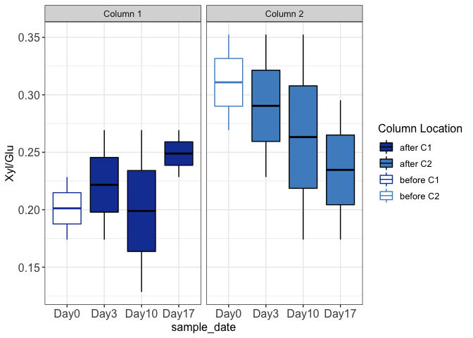

<!-- README.md is generated from README.Rmd. Please edit that file -->
# ExtracellularEnzymeActivity\_Data\_Prep

<!-- badges: start -->
<!-- badges: end -->
The goal of ExtracellularEnzymeActivity\_Data\_Prep is to import/clean and explore FLEE lab Extracellular Enzyme Activity (EEA) data from microplate readings. The data from the reader must be saved as .xlsx files, named after the sample as SampleDayNumber\_replicate\_factor (ex: S09\_B\_C3 in the sample case represents 9th day sample, replicate B, factor level "C3") within the "data" folder.

``` r
library(data.table)
library(readxl)
library(purrr)
library(ggplot2)
```

You'll still need to render `README.Rmd` regularly, to keep `README.md` up-to-date.

Get the file names as sample names and the functions

``` r
BiblioDir = list.dirs(path = "data", full.names =T, recursive = F)
paths = list.files(BiblioDir, full.names = T)
source("R/functions.R")
source("R/plotting_functions.R")
```

Read the enzyme activity data from the plate readings

``` r
Gly = enzyme_as_data_table(paths, func=read_glu)
Xyl = enzyme_as_data_table(paths, func=read_xyl)
Cbh = enzyme_as_data_table(paths, func=read_Cbh)
```

Data is stored as lists for ease of use when the sample number is high

``` r
list_data = map(list(Gly=Gly, Xyl=Xyl, Cbh=Cbh), convert_to_numeric)
list_data = map(list_data, calculate_mean)
```

Calculate each enzyme ratio separately. Check the functions folder for more details

``` r
ER_xyl_glu = calculate_xyl_gly (list_data)
ER_glu_xyl_cbh = calculate_glu.xyl_cbh (list_data)
```

Convert the NaN and Inf values to 0 since these are all below the detection limit values due to the negative data in the measurements.

``` r
list = list(ER_xyl_glu, ER_glu_xyl_cbh)
ER_data = Reduce(function (...)  merge(..., by="sample"), list) 

ER_data[is.nan.data.frame(ER_data)] <- 0
ER_data[is.inf.data.frame(ER_data)] <- 0
```

Cleaning and appropriately naming the factors

``` r
ER_data = set_coloring_column(ER_data)
Xyl_Glu = ggplot(ER_data, mapping = aes(x=sample_date, y = xyl_gly.median))+
  facet_grid(~col_no, labeller = as_labeller(col_names))+
  geom_boxplot(mapping = aes(fill = highlight, col = highlight))+
  fill_col_no2 () + color_col_no2() +
  theme_boxplot() +
  ylab("Xyl/Glu")

Xyl_Glu
```


