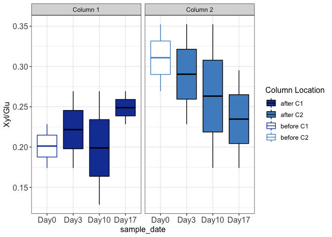

<!-- README.md is generated from README.Rmd. Please edit that file -->
# ExtracellularEnzymeActivity\_Data\_Prep

The goal of ExtracellularEnzymeActivity\_Data\_Prep is to import/clean and explore FLEE lab Extracellular Enzyme Activity (EEA) data from microplate readings. The data from the reader must be saved as .xlsx files, named after the sample as SampleDayNumber\_replicate\_factor (ex: S09\_B\_C3 in the sample case represents 9th day sample, replicate B, factor level "C3") within the "data" folder.

``` r
library(data.table)
library(readxl)
library(purrr)
library(ggplot2)
```

Get the file names as sample names and the functions

``` r
BiblioDir = list.dirs(path = "../data", full.names =T, recursive = F)
paths = list.files(BiblioDir, full.names = T)
substring(list.files(BiblioDir, full.names = T), 4, nchar(list.files(BiblioDir, full.names = T))-5)
#>  [1] "data/S09/S09_G_C1" "data/S09/S09_G_C2" "data/S09/S09_L_C1"
#>  [4] "data/S09/S09_L_C2" "data/S13/S13_C_C1" "data/S13/S13_C_C2"
#>  [7] "data/S13/S13_K_C1" "data/S13/S13_K_C2" "data/S16/S16_A_C1"
#> [10] "data/S16/S16_A_C2" "data/S16/S16_B_C1" "data/S16/S16_B_C2"
#> [13] "data/S19/S19_B_C1" "data/S19/S19_B_C2" "data/S19/S19_F_C1"
#> [16] "data/S19/S19_F_C2"
source("../R/functions.R")
source("../R/plotting_functions.R")
```

Read the enzyme activity data from the plate readings

``` r
Gly = enzyme_as_data_table(paths, func=read_glu)
Xyl = enzyme_as_data_table(paths, func=read_xyl)
Cbh = enzyme_as_data_table(paths, func=read_Cbh)
head(Cbh)
#>         sample        V1        V2        V3        V4        V5
#> 1: 09/S09_G_C1        NA  1.972578  2.069822         0         0
#> 2: 09/S09_G_C2 0.9713046 0.9826628 0.9457487 0.8350064 0.6135217
#> 3: 09/S09_L_C1  73.66194  72.43112  72.34309  68.64446   72.5593
#> 4: 09/S09_L_C2  24.88614  24.43797  24.06824   26.4211  24.92349
#> 5: 13/S13_C_C1        NA  1.972578  2.069822         0         0
#> 6: 13/S13_C_C2  73.66194  72.43112  72.34309  68.64446   72.5593
```

Data is stored as lists of dimensions (n x m x p) for ease of use when the sample number is high. n is the enzymes in the plate, within each has m number of samples with p variables ( in the following example 3 enzymes, 16 samples and 7 variables including sample name, 5 replicated and the mean/median of the replicates)

``` r
list_data = map(list(Gly=Gly, Xyl=Xyl, Cbh=Cbh), convert_to_numeric)
list_data = map(list_data, calculate_mean)
list_data = map(list_data, correct_name)
```

Calculate each enzyme ratio separately. Check the functions folder for more details

``` r
ER_xyl_glu = calculate_xyl_gly (list_data)
ER_glu_xyl_cbh = calculate_glu.xyl_cbh (list_data)
```

Convert the NaN and Inf values to 0 since these are all below the detection limit values due to the negative data in the measurements.

``` r
list = list(ER_xyl_glu, ER_glu_xyl_cbh)
ER_data = Reduce(function (...)  merge(..., by="sample"), list) 

ER_data[is.nan.data.frame(ER_data)] <- 0
ER_data[is.inf.data.frame(ER_data)] <- 0
head(ER_data)
#>      sample xyl_gly.median glu.xyl_cbh.median
#> 1: S09_G_C1      0.1740154          36.014517
#> 2: S09_G_C2      0.3524205          25.923712
#> 3: S09_L_C1      0.2284250           1.375598
#> 4: S09_L_C2      0.2693092           4.439046
#> 5: S13_C_C1      0.1740154          36.014517
#> 6: S13_C_C2      0.2284250           1.375598
```

Cleaning and appropriately naming the factors

``` r
ER_data[,c("sample_date", "replicate", "col_no") := tstrsplit(sample, "_")]
#Convert the sample date to days as a factor for ease in plotting
ER_data$sample_date = factor(ER_data$sample_date,
                           levels = c("S09", "S13", "S16", "S19"),
                           labels = c("Day0", "Day3", "Day10", "Day17")) 
ER_data$col_no = factor(ER_data$col_no,
                                 levels = c("C1", "C2"),
                                 labels = c("Col1", "Col2"))
# create a variable for the color scheme
ER_data = set_coloring_column(ER_data)
```


